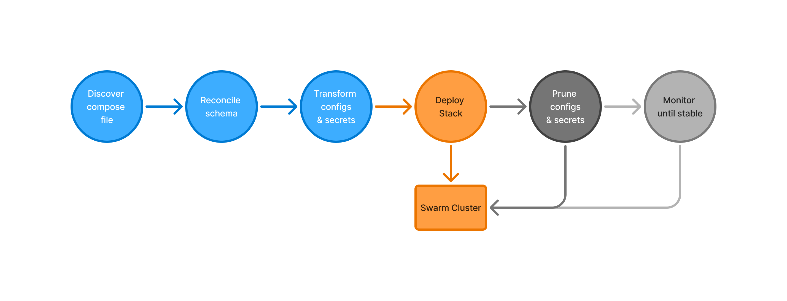

# Docker Swarm Deployments

[](https://github.com/matchory/docker-swarm-deployment-action/actions/workflows/linter.yml)
[](https://github.com/matchory/docker-swarm-deployment-action/actions/workflows/ci.yml)
[](https://github.com/matchory/docker-swarm-deployment-action/actions/workflows/check-dist.yml)
[](https://github.com/matchory/docker-swarm-deployment-action/actions/workflows/codeql-analysis.yml)
[](./badges/coverage.svg)

> A powerful GitHub Action to deploy your applications to a Docker Swarm
> cluster. It automatically reconciles features from the newer Compose
> Specification usually not available in Docker Swarm, rotates configs and
> secrets for you, and can optionally monitor stacks for any post-deployment
> issues (e.g., restart cycles or rollbacks) and let the deployment fail
> accordingly.  
> Designed to "do the right thing" out of the box, with flexible options for
> customization.



## ✨ Features

- **Easy Setup:** The action uses
  [the same environment variables](https://docs.docker.com/reference/cli/docker/#environment-variables)
  as the Docker CLI, so you can connect to your Docker Swarm cluster using a
  context, and via all transports supported by Docker (e.g., HTTP, TCP, SSH,
  etc.).
- **Smart Compose Handling:** It automatically discovers your Compose file and
  supports both the Compose Specification and Compose File v3, so you don't have
  to worry about incompatibilities.
- **Automatic Config & Secret Management:** It rotates secrets and configs
  automatically and can even transform their data on-the-fly (e.g., base64
  encode/decode).
- **Reliable Deployments:** Validates your configuration before deploying using
  `docker stack config`.
- **Optional Post-Deployment Monitoring:** Ensures your services are stable
  after deployment.
- **Fully Tested:** An extensive test suite ensures the action works as
  expected.

## 🚀 Getting Started

### Prerequisites

- A Docker Swarm cluster accessible in the GitHub Actions environment
- A Docker Compose file

### Simple Usage

In most cases, you don't need to explicitly tell the action where your Compose
file is. If your file is named commonly (like `compose.yaml`, `compose.yml`, 
`docker-compose.yaml`, or `docker-compose.production.yml`) and is in your 
repository's root or a standard location, the action will find it automatically.

Here's a basic workflow example:

```yaml
name: Deploy to Docker Swarm
on:
  push:
    branches:
      - main

jobs:
  deploy:
    steps:
      - name: Checkout code
          uses: actions/checkout@v4

      - name: Deploy to Docker Swarm
          uses: matchory/deployment@v1
          environment:
            DOCKER_HOST: tcp://my-swarm-host:2375
```

You could also leverage a Docker context to connect to your Swarm cluster. This
is the recommended way to connect to a remote Docker host, as it allows you to
use SSH or TLS for secure connections:

```yaml
name: Deploy to Docker Swarm
on:
  push:
    branches:
      - main

jobs:
  deploy:
    steps:
      - name: Checkout code
        uses: actions/checkout@v4

      - uses: arwynfr/actions-docker-context@v2
        with:
          context_name: "swarm"
          docker_host: "ssh://someone@example.domain.tld"
          ssh_cert: ${{ secrets.SSH_CERT }}
          ssh_key: ${{ secrets.SSH_KEY }}

      - name: Deploy to Docker Swarm
        uses: matchory/deployment@v1
        env:
          DOCKER_CONTEXT: swarm
```

## ⚙️ Configuration

### Inputs

To configure the action, you can use the following inputs:

| Input              | Default                               | Description                                                                                                                       |
| :----------------- | :------------------------------------ | :-------------------------------------------------------------------------------------------------------------------------------- |
| `stack-name`       | _Repository name_                     | The name of the stack to deploy. If not specified, the repository name (without the "user/" part) will be used.                   |
| `version`          | _Tag Name&thinsp;/&thinsp;Commit SHA_ | The version of the stack to deploy. If not specified, the action will use the tag name or commit SHA of the build.                |
| `compose-file`     | _—_                                   | The path to the compose file. If not specified, the action will [automatically search for it](#how-compose-file-detection-works). |
| `env-var-prefix`   | `DEPLOYMENT_`                         | Prefix to resolve variables intended for [auto-configuration of variables](#smart-variable-resolution).                           |
| `manage-variables` | `true`                                | Whether to automatically [manage configs and secrets](#configuring-secrets-and-configs).                                          |
| `strict-variables` | `false`                               | Whether to throw an error if a variable specified in the compose spec is not defined.                                             |
| `variables`        | _—_                                   | Variables as KEY=value pairs, separated by new lines, to apply in the environment. Can be used to set secrets.                    |
| `monitor`          | `false`                               | Whether to [monitor the stack](#post-deployment-monitoring) after deployment.                                                     |
| `monitor-timeout`  | `300`                                 | The maximum time in seconds to wait for the stack to stabilize.                                                                   |
| `monitor-interval` | `10`                                  | The interval in seconds to check the stack status.                                                                                |

### Outputs

| Output         | Description                                                          |
| :------------- | :------------------------------------------------------------------- |
| `status`       | The status of the deployment. Possible values: `success`, `failure`. |
| `stack-name`   | The name of the stack that was deployed.                             |
| `version`      | The version of the stack that was deployed.                          |
| `compose-spec` | The final compose specification used for the deployment.             |
| `service-logs` | Logs of a failed service after deployment.                           |

## 📖 Reference

### How Compose File Detection Works

If the `compose-file` input is not specified, the action automatically searches
for your Compose File(s) in the following common locations and names, in
descending order:

1. `compose.production.yaml`
2. `compose.production.yml`
3. `compose.prod.yaml`
4. `compose.prod.yml`
5. `compose.yaml`
6. `compose.yml`
7. `docker-compose.production.yaml`
8. `docker-compose.production.yml`
9. `docker-compose.prod.yaml`
10. `docker-compose.prod.yml`
11. `docker-compose.yaml`
12. `docker-compose.yml`
13. `.docker/compose.yaml`
14. `.docker/compose.yml`
15. `.docker/docker-compose.yaml`
16. `.docker/docker-compose.yml`
17. `docker/compose.yaml`
18. `docker/compose.yml`
19. `docker/docker-compose.yaml`
20. `docker/docker-compose.yml`

The first file found will be used. Modern `compose.*` files take priority over
legacy `docker-compose.*` files, following the 
[Compose Specification](https://www.compose-spec.io/) standardized in 2021.
This covers most standard project structures while maintaining full backward
compatibility.

#### Using environment variables

The action also respects the `COMPOSE_FILE` environment variable if set, and
multiple files specified there or via the `compose-file` input can be separated
by the `COMPOSE_FILE_SEPARATOR` environment variable (defaults to `:`).

#### Specifying a Custom Compose File, or Multiple Files

If your Compose File doesn't follow the automatic detection pattern, or you need
to use multiple Compose Files (which will be merged), use the compose-file
input:

```yaml
- name: Deploy with Custom Compose File
  uses: your-github-username/your-repo-name@v1
  with:
    stack-name: my-application
    compose-file: path/to/your/custom-compose.yaml
```

To use multiple files:

```yaml
- name: Deploy with Multiple Compose Files
  uses: your-github-username/your-repo-name@v1
  with:
    stack-name: my-application
    compose-file: compose.yaml:compose.override.yaml # Using default separator ':'
    # Or with a different separator:
    # compose-file: compose.yaml,compose.override.yaml
    # env:
    #   COMPOSE_FILE_SEPARATOR: ','
```

### How Compose Files Are Processed

The action is designed to be flexible and robust when it comes to your Compose
files. It doesn't strictly require either the old v3 format or the new Compose
Specification. Instead, it:

- Reads your specified (or detected) Compose File(s).
- Applies internal transformations to handle known differences between formats
  for Swarm compatibility.
- Uses `docker stack config` to validate the resulting configuration and merge
  multiple files into a single, canonical Compose Specification.

This ensures that regardless of the exact format you use (even mixing them), the
final configuration passed to `docker stack deploy` is valid and correctly
interpreted by Docker Swarm.

#### Variable interpolation

All environment variables inside the Compose Spec(s) will be interpolated
automatically according to the
[Compose Specification rules](https://docs.docker.com/reference/compose-file/interpolation/),
with one optional improvement: If you enable the `key-interpolation` input, the
action will also replace environment variables in all keys in your Compose Spec,
not just in values. This is useful for dynamic service names or other keys that
depend on environment variables.

The following syntax is supported for variable interpolation:

```yaml
- "$VARIABLE_NAME"
- "${VARIABLE_NAME}"
- "${VARIABLE_NAME-default if not set}"
- "${VARIABLE_NAME:-default if not set or empty}"
- "${VARIABLE_NAME+alternative if set}"
- "${VARIABLE_NAME:+alternative if set and not empty}"
- "${VARIABLE_NAME?error if not set}"
- "${VARIABLE_NAME:?error if not set or empty}"
```

In contrast to the legacy Compose File v3 format, the Compose Specification (and
the implementation in this action) do allow for unlimited recursive
interpolation, meaning that the following will work as expected:

```yaml
- "${FOO:-${BAR:-${BAZ}}}"
```

In addition to all variables in the process environment and those
[passed in the `variables` input](#providing-github-secrets-and-variables), the
following variables derived from the inputs are also available:

- `MATCHORY_DEPLOYMENT_STACK`: The name of the stack being deployed.
- `MATCHORY_DEPLOYMENT_VERSION`: The version of the stack being deployed.

### Configuring Secrets and Configs

#### Loading Environment Variables or inline Content

Docker Swarm only supports reading configs and secrets from files, but the
Compose Specification allows you to use the
[`environment`](https://docs.docker.com/reference/compose-file/secrets/#example-2)
and
[`content`](https://docs.docker.com/reference/compose-file/configs/#example-2)
properties to load them from environment variables or inline content,
respectively. This action automatically converts these properties to files, so
you can use them in your Compose File without worrying about the deployment.

For example, if you have a Compose File with the following configs:

```yaml
configs:
  app_url:
    environment: APP_URL
  database_username:
    content: root
```

The action will automatically create files for these configs, and the resulting
specification file passed to the actual `docker stack deploy` call will look
like this:

```yaml
configs:
  app_url:
    file: ./app_url.1740e753-0a19-446a-ba6e-361b24f5d9e1.generated.secret
    # omitting rest for brevity
  database_username:
    file: ./database_username.c95397dc-c300-4125-b95e-e2ce43821d72.generated.secret
    # omitting rest for brevity
```

The action will create the files in the same directory as the Compose File and
append a unique identifier to the filename to avoid conflicts. The files will be
removed after the deployment is complete, so you don't have to worry about
leaving temporary files behind to the next action.

#### Smart Variable Resolution

You don't have to specify the data source (`file`, `environment`, or `content`)
manually: In fact, you don't have to add any properties at all! The following
example will work just as well:

```yaml
configs:
  # Pass an empty object, …
  app_url: {}

  # …or even a YAML-null value for brevity!
  database_username: ~
```

The action will attempt to resolve the variable content automatically, and
populate the `file` property with that. This is done by the following rules:

1. If a file with the name of the variable exists in working directory named
   like the variable key with the suffix ".secret" (e.g. `./app_url.secret`), it
   will be used as the file source.
2. If an environment variable with one of the following name patterns exists, it
   will be used as the environment source:n
   - Exact variable key (e.g. `app_url`)
   - Uppercase variable key (e.g. `APP_URL`)
   - Variable key prefixed with the [`envVarPrefix`](#inputs) (e.g.
     `DEPLOYMENT_app_url`)
   - Uppercase variable key prefixed with the [env var prefix setting](#inputs)
     (e.g. `DEPLOYMENT_APP_URL`)
   - Variable key prefixed with the [stack name](#inputs) (e.g.
     `my_repo_app_url`)
   - Uppercase variable key prefixed with the [stack name](#inputs) (e.g.
     `MY_REPO_APP_URL`)
3. If neither of the above is found, an error will be thrown and the action will
   fail.

#### Providing GitHub Secrets and Variables

You can use GitHub Secrets and Variables to provide the values for your configs.
This can be challenging if you have many variables, as you need to explicitly
pass each one to the action; in cases where you use this action in a nested
workflow, this means you have to define them in multiple places.  
To avoid that, you can use the `variables` input to pass a list of key-value
pairs, which will override any variables of the same name defined in the process
environment:

```yaml
- name: Deploy to Docker Swarm
  uses: matchory/deployment@v1
  with:
    stack-name: my-application
    variables: |
      APP_URL=https://myapp.example.com
      DATABASE_USERNAME=${{ vars.DATABASE_USERNAME }}
      DATABASE_PASSWORD=${{ secrets.DATABASE_PASSWORD }}
```

#### Automatic Rotation

A major pain point deploying applications to Docker Swarm is managing secrets
and configs (henceforth called _"variables"_), which are designed to be
immutable and cannot be updated in place. This action automates the process of
creating new variables when deploying and updating the stack to use them.  
To make this work, the action detects changes to the _content_ of variables
referenced in the Compose File by storing their SHA256 hash in a label on the
variable and appending it to the full name. For example, given the following
config in the Compose File:

```yaml
configs:
  database_username:
    content: root
```

The action will transform it to:

```yaml
configs:
  database_username:
    name: YOUR_STACK-database_username-53175bc
    file: ./database_username.36934723-0a0b-4eb6-ab9d-d3a4e5e3cb34.generated.secret
    labels:
      com.matchory.deployment.name: database_username
      com.matchory.deployment.hash: 53175bcc0524f37b47062fafdda28e3f8eb91d519ca0a184ca71bbebe72f969a
      com.matchory.deployment.stack: YOUR_STACK
      com.matchory.deployment.version: VERSION
```

_(`YOUR_STACK` and `VERSION` are placeholders for the actual stack name and
version as defined in the settings)_

This has two notable implications:

1. As the short SHA256 hash is appended to the variable name, it will stay
   stable if the content doesn't change across deployments, which avoids
   unnecessary updates to the stack. If the database username stays root, the
   stack will continue to use the variable created in the initial deployment,
   even if other variables or settings are updated.
2. After the deployment is complete, the action will prune any unused variables
   by checking the labels. If a variable is not referenced in the Compose File
   anymore, it will be safely removed from the cluster. This is important to
   keep the cluster clean and avoid cluttering it with old variables.

#### Configuring the Variable Name

The deployment action will automatically construct the variable name from the
following template:

```typescript
`${stackName}-${variableName}-${hash.slice(0, 7)}`;
```

As the name must be globally unique, this includes the stack name, the name of
the variable (the key in the Compose File), and the first seven characters of
the hash. This ensures that even if two stacks use the same variable name, they
will not conflict.  
If you provide a custom name for the variable, it will be used verbatim, but
**the hash will still be appended**. This is necessary to enable automatic
change detection and pruning.

#### Disabling Automatic Variable Management

If you want to manage your variables manually, you can either disable the
automatic variable management altogether by setting the `manage-variables` input
to `false`, or you can add the `com.matchory.deployment.ignore` label to the
variable:

```yaml
configs:
  dotenv:
    file: .env
    labels:
      com.matchory.deployment.ignore: "true"
```

This will prevent the action from touching the variable, and it will not be
pruned after the deployment. Note that this will also disable the automatic
conversion of compose-spec-style inputs from `content` or `environment`.

#### Data Transformation

You can optionally transform the data of your configs and secrets during the
deployment process using labels in your Compose File. This is useful for
handling sensitive data that might be stored in an encoded format.  
Add either the `com.matchory.deployment.encode` or
`com.matchory.deployment.decode` label to your config or secret definition,
specifying one of the supported formats:

- `base64`
- `base64url`
- `hex`
- `url`

For example, to load a base64-encoded environment variable:

```yaml
configs:
  my_config:
    environment: BASE64_ENCODED_PEM_KEY
    labels:
      com.matchory.deployment.decode: "base64"
```

This will decode the variable before passing it to the container, resulting in a
properly formatted, multi-line PEM key in the container file system.

Do you have a different encoding in mind? Feel free to open an issue or PR, and
we can add it to the action.

### How the stack is deployed

To deploy the final specification, the action uses the `docker stack deploy`
command effectively like this:

```shell
echo $final_schema | docker stack deploy \
     --resolve-image=always \
     --with-registry-auth \
     --compose-file "-" \
     --detach \
     --prune \
  $stack_name
```

### Post-Deployment Monitoring

The action can optionally monitor your stacks for any post-deployment issues
(e.g., restart cycles or rollbacks) and fail the deployment accordingly. This is
done by checking the status of the services in the stack after the deployment,
waiting until all services are running and stable.  
Especially for bigger deployments, this can take a while, so the monitoring
feature is disabled by default. You can enable it by setting the `monitor` input
to `true`.

**Note that a monitoring failure will _not_ automatically roll back the stack.**
Swarm takes care of that itself. Stack Monitoring solves a different problem: It
makes sure an update to a stack is not only successful, but also stable, that
is, it doesn't roll back or restart any services after the deployment. If that
happens, and the stack does not stabilize, monitoring will fail the action and
notify you of the issue.

#### Monitoring Timeout & Interval

The action will wait for a configurable maximum of `monitor-timeout` seconds for
the services to stabilize, checking their status every `monitor-interval`
seconds. The default values are 5 minutes and 10 seconds, respectively.

You can adjust these values to suit your needs. For example, if you want to wait
for 10 minutes and check every 30 seconds, you can set the following inputs:

```yaml
jobs:
  deploy:
    steps:
      - name: Deploy to Docker Swarm
        uses: matchory/deployment@v1
        uses: matchory/deployment@v1
        with:
          monitor: true
          monitor-timeout: 600 # 10 minutes
          monitor-interval: 30 # 30 seconds
```

## 🔨 Contributing

Contributions are welcome! If you have any ideas, suggestions, or bug reports,
please open an issue or a pull request.
